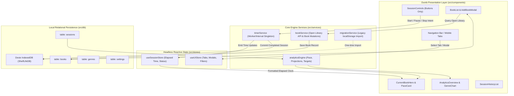

# 🏛️ Shelf Life 2.0 - Architecture & Project Index

> **AUTO-GENERATED SYSTEM INDEX** — DO NOT EDIT MANUALLY.
> Regenerate with `npm run index` or automatically via `npm run build`.
> Last Index Run: 2026-09-26T15:43:18.131Z

## 🎯 1. System Sources of Truth (Singletons, Engines & Stores)

| Store / Entity | File / Location | Engine / Persistence | Responsibility |
| :--- | :--- | :--- | :--- |
| **Database (Dexie)** | `src/db/db.js` | IndexedDB (`ShelfLifeDB`) | Relational database: `books`, `sessions`, `genres`, `settings` |
| **Session Timer Engine** | `src/services/timerService.js` | Headless Timer Singleton | Precision ticker, drift compensation, state machine (`idle|reading|paused`) |
| **Active Session Store** | `src/stores/useSessionStore.js` | Zustand Store | Reactive active session bridge consumed by UI presentation cards |
| **UI State Store** | `src/stores/useUIStore.js` | Zustand Store | Tab routing, modal visibility, filter tags, search text |
| **Analytics Engine** | `src/services/analyticsEngine.js` | Pure Calculation Engine | PPM, WPM, completion date projections, daily targets, genre ratios |
| **Open Library Service**| `src/services/bookService.js` | REST Client | Open Library book metadata search & cover resolution |
| **Legacy Migration Engine**| `src/services/migrationService.js`| One-time Migrator | Detects legacy localStorage data and safely imports into Dexie DB |

## 🔄 2. End-to-End Data Flow Blueprint

## 📦 3. Module Catalog & Architectural Role

Total workspace files tracked: **76** | Total LOC: **13144**

| File | LOC | Type / Architectural Role | Exports & Public Symbols | Storage / APIs |
| :--- | :--- | :--- | :--- | :--- |
| [`.github/workflows/deploy.yml`](file:///D:/Users/bfezu/Coding Projects/Shelf_Life/.github/workflows/deploy.yml) | 50 | Static Asset | — | — |
| [`.gitignore`](file:///D:/Users/bfezu/Coding Projects/Shelf_Life/.gitignore) | 37 | Static Asset | — | — |
| [`default-cover-large.svg`](file:///D:/Users/bfezu/Coding Projects/Shelf_Life/default-cover-large.svg) | 4 | Static Asset | — | — |
| [`default-cover-small.svg`](file:///D:/Users/bfezu/Coding Projects/Shelf_Life/default-cover-small.svg) | 4 | Static Asset | — | — |
| [`default-cover.svg`](file:///D:/Users/bfezu/Coding Projects/Shelf_Life/default-cover.svg) | 4 | Static Asset | — | — |
| [`Icon_192.svg`](file:///D:/Users/bfezu/Coding Projects/Shelf_Life/Icon_192.svg) | 99 | Static Asset | — | — |
| [`Icon_512.svg`](file:///D:/Users/bfezu/Coding Projects/Shelf_Life/Icon_512.svg) | 99 | Static Asset | — | — |
| [`index.html`](file:///D:/Users/bfezu/Coding Projects/Shelf_Life/index.html) | 22 | SPA Host Document | — | — |
| [`Logo_Header.svg`](file:///D:/Users/bfezu/Coding Projects/Shelf_Life/Logo_Header.svg) | 120 | Static Asset | — | — |
| [`manifest.json`](file:///D:/Users/bfezu/Coding Projects/Shelf_Life/manifest.json) | 29 | Static Asset | — | — |
| [`package.json`](file:///D:/Users/bfezu/Coding Projects/Shelf_Life/package.json) | 42 | Package Manifest | — | — |
| [`public/default-cover-large.svg`](file:///D:/Users/bfezu/Coding Projects/Shelf_Life/public/default-cover-large.svg) | 4 | Static Asset | — | — |
| [`public/default-cover-small.svg`](file:///D:/Users/bfezu/Coding Projects/Shelf_Life/public/default-cover-small.svg) | 4 | Static Asset | — | — |
| [`public/default-cover.svg`](file:///D:/Users/bfezu/Coding Projects/Shelf_Life/public/default-cover.svg) | 4 | Static Asset | — | — |
| [`public/Icon_192.svg`](file:///D:/Users/bfezu/Coding Projects/Shelf_Life/public/Icon_192.svg) | 99 | Static Asset | — | — |
| [`public/Icon_512.svg`](file:///D:/Users/bfezu/Coding Projects/Shelf_Life/public/Icon_512.svg) | 99 | Static Asset | — | — |
| [`public/Logo_Header.svg`](file:///D:/Users/bfezu/Coding Projects/Shelf_Life/public/Logo_Header.svg) | 120 | Static Asset | — | — |
| [`README.md`](file:///D:/Users/bfezu/Coding Projects/Shelf_Life/README.md) | 143 | Static Asset | — | — |
| [`scripts/generate-index.js`](file:///D:/Users/bfezu/Coding Projects/Shelf_Life/scripts/generate-index.js) | 261 | Build / Indexing Automation | `walkDir()`, `analyzeFile()`, `generateMarkdownIndex()` | Open Library REST API |
| [`src/App.jsx`](file:///D:/Users/bfezu/Coding Projects/Shelf_Life/src/App.jsx) | 235 | Root Application Shell | `App()`, `loadPalette()`, `initApp()` | — |
| [`src/components/analytics/GenreBreakdown.jsx`](file:///D:/Users/bfezu/Coding Projects/Shelf_Life/src/components/analytics/GenreBreakdown.jsx) | 101 | Dumb UI Presentation | `GenreBreakdown()` | — |
| [`src/components/analytics/ReadingTrends.jsx`](file:///D:/Users/bfezu/Coding Projects/Shelf_Life/src/components/analytics/ReadingTrends.jsx) | 153 | Dumb UI Presentation | `ReadingTrends()` | — |
| [`src/components/analytics/StatsOverview.jsx`](file:///D:/Users/bfezu/Coding Projects/Shelf_Life/src/components/analytics/StatsOverview.jsx) | 99 | Dumb UI Presentation | `StatsOverview()` | — |
| [`src/components/current/CurrentBookHero.jsx`](file:///D:/Users/bfezu/Coding Projects/Shelf_Life/src/components/current/CurrentBookHero.jsx) | 333 | Dumb UI Presentation | `CurrentBookHero()`, `handleSavePage()` | — |
| [`src/components/current/PaceStatsCard.jsx`](file:///D:/Users/bfezu/Coding Projects/Shelf_Life/src/components/current/PaceStatsCard.jsx) | 227 | Dumb UI Presentation | `PaceStatsCard()` | — |
| [`src/components/current/ReadingCockpit.jsx`](file:///D:/Users/bfezu/Coding Projects/Shelf_Life/src/components/current/ReadingCockpit.jsx) | 237 | Dumb UI Presentation | `ReadingCockpit()`, `handleStart()`, `handlePause()`, `handleResume()` | — |
| [`src/components/current/SessionControls.jsx`](file:///D:/Users/bfezu/Coding Projects/Shelf_Life/src/components/current/SessionControls.jsx) | 186 | Dumb UI Presentation | `SessionControls()`, `handleStart()`, `handlePause()`, `handleResume()` | — |
| [`src/components/diorama/BottomDockBar.jsx`](file:///D:/Users/bfezu/Coding Projects/Shelf_Life/src/components/diorama/BottomDockBar.jsx) | 174 | Dumb UI Presentation | `BottomDockBar()`, `handleStart()`, `handlePause()`, `handleResume()` | — |
| [`src/components/diorama/LeftDockPanel.jsx`](file:///D:/Users/bfezu/Coding Projects/Shelf_Life/src/components/diorama/LeftDockPanel.jsx) | 358 | Dumb UI Presentation | `LeftDockPanel()`, `handleIncrementPage()`, `handleSavePage()` | — |
| [`src/components/editorial/DetailSlidePanel.jsx`](file:///D:/Users/bfezu/Coding Projects/Shelf_Life/src/components/editorial/DetailSlidePanel.jsx) | 255 | Dumb UI Presentation | `DetailSlidePanel()`, `handleSave()`, `handleSetFocus()`, `handleDelete()` | — |
| [`src/components/editorial/EditorialHUD.jsx`](file:///D:/Users/bfezu/Coding Projects/Shelf_Life/src/components/editorial/EditorialHUD.jsx) | 78 | Dumb UI Presentation | `EditorialHUD()`, `handlePrev()`, `handleNext()`, `handleInspect()` | — |
| [`src/components/layout/Header.jsx`](file:///D:/Users/bfezu/Coding Projects/Shelf_Life/src/components/layout/Header.jsx) | 130 | Dumb UI Presentation | `Header()` | — |
| [`src/components/layout/LookAheadHeader.jsx`](file:///D:/Users/bfezu/Coding Projects/Shelf_Life/src/components/layout/LookAheadHeader.jsx) | 86 | Dumb UI Presentation | `LookAheadHeader()` | — |
| [`src/components/layout/Navigation.jsx`](file:///D:/Users/bfezu/Coding Projects/Shelf_Life/src/components/layout/Navigation.jsx) | 101 | Dumb UI Presentation | `Navigation()` | — |
| [`src/components/layout/ShelfLifeLogo.jsx`](file:///D:/Users/bfezu/Coding Projects/Shelf_Life/src/components/layout/ShelfLifeLogo.jsx) | 136 | Dumb UI Presentation | `ShelfLifeLogo()` | — |
| [`src/components/library/AddBookModal.jsx`](file:///D:/Users/bfezu/Coding Projects/Shelf_Life/src/components/library/AddBookModal.jsx) | 617 | Dumb UI Presentation | `AddBookModal()`, `handleSearch()`, `handleSelectBook()`, `handleStartManual()` | Open Library REST API |
| [`src/components/library/BookCard.jsx`](file:///D:/Users/bfezu/Coding Projects/Shelf_Life/src/components/library/BookCard.jsx) | 188 | Dumb UI Presentation | `BookCard()`, `handleSetFocus()`, `getStatusBadge()` | — |
| [`src/components/library/BookDetailModal.jsx`](file:///D:/Users/bfezu/Coding Projects/Shelf_Life/src/components/library/BookDetailModal.jsx) | 895 | Dumb UI Presentation | `BookDetailModal()`, `formatDate()`, `formatSessionTime()`, `handleRatingChange()` | — |
| [`src/components/library/BookList.jsx`](file:///D:/Users/bfezu/Coding Projects/Shelf_Life/src/components/library/BookList.jsx) | 209 | Dumb UI Presentation | `BookList()` | — |
| [`src/components/mobile/MobileSheetPanel.jsx`](file:///D:/Users/bfezu/Coding Projects/Shelf_Life/src/components/mobile/MobileSheetPanel.jsx) | 397 | Dumb UI Presentation | `MobileSheetPanel()`, `handleStart()`, `handlePause()`, `handleResume()` | — |
| [`src/components/modals/CustomColorPicker.jsx`](file:///D:/Users/bfezu/Coding Projects/Shelf_Life/src/components/modals/CustomColorPicker.jsx) | 260 | Dumb UI Presentation | `hexToHsl()`, `hslToHex()`, `f()`, `CustomColorPicker()` | — |
| [`src/components/modals/DataManagementModal.jsx`](file:///D:/Users/bfezu/Coding Projects/Shelf_Life/src/components/modals/DataManagementModal.jsx) | 175 | Dumb UI Presentation | `DataManagementModal()`, `handleExport()`, `handleImportFile()` | — |
| [`src/components/modals/FinishSessionModal.jsx`](file:///D:/Users/bfezu/Coding Projects/Shelf_Life/src/components/modals/FinishSessionModal.jsx) | 187 | Dumb UI Presentation | `FinishSessionModal()`, `handleSubmit()` | — |
| [`src/components/modals/PageScannerModal.jsx`](file:///D:/Users/bfezu/Coding Projects/Shelf_Life/src/components/modals/PageScannerModal.jsx) | 696 | Dumb UI Presentation | `PageScannerModal()`, `handleFileChange()`, `processImage()`, `handleRemoveSample()` | — |
| [`src/components/modals/PaletteCustomizerModal.jsx`](file:///D:/Users/bfezu/Coding Projects/Shelf_Life/src/components/modals/PaletteCustomizerModal.jsx) | 353 | Dumb UI Presentation | `PaletteCustomizerModal()`, `loadColors()`, `handleSelectSwatch()`, `handleResetToAuto()` | — |
| [`src/components/modals/ReadingSpeedTestModal.jsx`](file:///D:/Users/bfezu/Coding Projects/Shelf_Life/src/components/modals/ReadingSpeedTestModal.jsx) | 602 | Dumb UI Presentation | `ReadingSpeedTestModal()`, `loadFreshExcerpt()`, `handleStartReading()`, `handleFinishReading()` | — |
| [`src/components/modals/SpeedOverrideModal.jsx`](file:///D:/Users/bfezu/Coding Projects/Shelf_Life/src/components/modals/SpeedOverrideModal.jsx) | 147 | Dumb UI Presentation | `SpeedOverrideModal()`, `handleSave()` | — |
| [`src/components/scene/FullPageCanvas.jsx`](file:///D:/Users/bfezu/Coding Projects/Shelf_Life/src/components/scene/FullPageCanvas.jsx) | 66 | Dumb UI Presentation | `FullPageCanvas()` | — |
| [`src/components/scene/Library3DView.jsx`](file:///D:/Users/bfezu/Coding Projects/Shelf_Life/src/components/scene/Library3DView.jsx) | 77 | Dumb UI Presentation | `Library3DView()` | — |
| [`src/components/sessions/SessionHistoryList.jsx`](file:///D:/Users/bfezu/Coding Projects/Shelf_Life/src/components/sessions/SessionHistoryList.jsx) | 139 | Dumb UI Presentation | `SessionHistoryList()`, `handleToggleExclude()`, `handleDeleteSession()`, `formatDate()` | — |
| [`src/db/db.js`](file:///D:/Users/bfezu/Coding Projects/Shelf_Life/src/db/db.js) | 16 | Relational Persistence Layer | class `ShelfLifeDB` | Dexie: books, Dexie: title, Dexie: author, Dexie: status, Dexie: due_date, Dexie: created_at, Dexie: *genres, Dexie: sessions, Dexie: book_id, Dexie: start_time, Dexie: end_time, Dexie: exclude_from_pace, Dexie: genres, Dexie: &name, Dexie: settings |
| [`src/index.css`](file:///D:/Users/bfezu/Coding Projects/Shelf_Life/src/index.css) | 192 | Tailwind v4 Theme Styles | — | — |
| [`src/main.jsx`](file:///D:/Users/bfezu/Coding Projects/Shelf_Life/src/main.jsx) | 11 | Application Entrypoint | — | — |
| [`src/scene/AnalyticsDeskArea.js`](file:///D:/Users/bfezu/Coding Projects/Shelf_Life/src/scene/AnalyticsDeskArea.js) | 103 | Static Asset | class `AnalyticsDeskArea` | — |
| [`src/scene/BookObject.js`](file:///D:/Users/bfezu/Coding Projects/Shelf_Life/src/scene/BookObject.js) | 162 | Static Asset | class `BookObject` | — |
| [`src/scene/BookshelfModel.js`](file:///D:/Users/bfezu/Coding Projects/Shelf_Life/src/scene/BookshelfModel.js) | 123 | Static Asset | class `BookshelfModel` | — |
| [`src/scene/diorama/DeskDiorama.js`](file:///D:/Users/bfezu/Coding Projects/Shelf_Life/src/scene/diorama/DeskDiorama.js) | 426 | Static Asset | class `DeskDiorama` | — |
| [`src/scene/diorama/DioramaSceneManager.js`](file:///D:/Users/bfezu/Coding Projects/Shelf_Life/src/scene/diorama/DioramaSceneManager.js) | 286 | Static Asset | class `DioramaSceneManager` | — |
| [`src/scene/diorama/HeroBookObject.js`](file:///D:/Users/bfezu/Coding Projects/Shelf_Life/src/scene/diorama/HeroBookObject.js) | 164 | Static Asset | class `HeroBookObject` | — |
| [`src/scene/diorama/LibraryShelvesModel.js`](file:///D:/Users/bfezu/Coding Projects/Shelf_Life/src/scene/diorama/LibraryShelvesModel.js) | 96 | Static Asset | class `LibraryShelvesModel` | — |
| [`src/scene/HistoryArchiveArea.js`](file:///D:/Users/bfezu/Coding Projects/Shelf_Life/src/scene/HistoryArchiveArea.js) | 78 | Static Asset | class `HistoryArchiveArea` | — |
| [`src/scene/LibraryShelvesArea.js`](file:///D:/Users/bfezu/Coding Projects/Shelf_Life/src/scene/LibraryShelvesArea.js) | 183 | Static Asset | class `LibraryShelvesArea` | — |
| [`src/scene/materials.js`](file:///D:/Users/bfezu/Coding Projects/Shelf_Life/src/scene/materials.js) | 271 | Static Asset | `loadCoverTexture()`, `createFineWoodTexture()`, `createPaperEdgeTexture()`, `createContactShadowTexture()` | — |
| [`src/scene/ReadingNookArea.js`](file:///D:/Users/bfezu/Coding Projects/Shelf_Life/src/scene/ReadingNookArea.js) | 126 | Static Asset | class `ReadingNookArea` | — |
| [`src/scene/SceneManager.js`](file:///D:/Users/bfezu/Coding Projects/Shelf_Life/src/scene/SceneManager.js) | 290 | Static Asset | class `SceneManager` | — |
| [`src/services/analyticsEngine.js`](file:///D:/Users/bfezu/Coding Projects/Shelf_Life/src/services/analyticsEngine.js) | 191 | Core Engine / Service | — | — |
| [`src/services/bookService.js`](file:///D:/Users/bfezu/Coding Projects/Shelf_Life/src/services/bookService.js) | 187 | Core Engine / Service | `cleanGenres()` | Open Library REST API |
| [`src/services/colorExtractor.js`](file:///D:/Users/bfezu/Coding Projects/Shelf_Life/src/services/colorExtractor.js) | 302 | Core Engine / Service | `getTextOnColor()`, `extractPaletteFromImage()`, `rgbToHex()`, `adjustColor()` | — |
| [`src/services/exportImportService.js`](file:///D:/Users/bfezu/Coding Projects/Shelf_Life/src/services/exportImportService.js) | 68 | Core Engine / Service | — | — |
| [`src/services/migrationService.js`](file:///D:/Users/bfezu/Coding Projects/Shelf_Life/src/services/migrationService.js) | 136 | Core Engine / Service | `runLegacyMigrationIfNeeded()` | localStorage: shelfLife_books, localStorage: shelfLife_sessions, localStorage: shelfLife_genres, localStorage: currentBookId, localStorage: shelfLife_baselineWPM |
| [`src/services/sessionService.js`](file:///D:/Users/bfezu/Coding Projects/Shelf_Life/src/services/sessionService.js) | 56 | Core Engine / Service | — | — |
| [`src/services/speedTestService.js`](file:///D:/Users/bfezu/Coding Projects/Shelf_Life/src/services/speedTestService.js) | 231 | Core Engine / Service | — | — |
| [`src/services/timerService.js`](file:///D:/Users/bfezu/Coding Projects/Shelf_Life/src/services/timerService.js) | 150 | Core Engine / Service | class `TimerService` | — |
| [`src/stores/useSessionStore.js`](file:///D:/Users/bfezu/Coding Projects/Shelf_Life/src/stores/useSessionStore.js) | 31 | Headless Reactive Store | — | — |
| [`src/stores/useUIStore.js`](file:///D:/Users/bfezu/Coding Projects/Shelf_Life/src/stores/useUIStore.js) | 58 | Headless Reactive Store | — | — |
| [`vite.config.mjs`](file:///D:/Users/bfezu/Coding Projects/Shelf_Life/vite.config.mjs) | 66 | Static Asset | — | — |

## 🛡️ 4. Architecture Guardrails Compliance Audit

### ⚠️ 400-LOC Ceiling Violations
- [`src/components/library/AddBookModal.jsx`](file:///D:/Users/bfezu/Coding Projects/Shelf_Life/src/components/library/AddBookModal.jsx) (617 lines) — *Must be decomposed into smaller sub-components.*
- [`src/components/library/BookDetailModal.jsx`](file:///D:/Users/bfezu/Coding Projects/Shelf_Life/src/components/library/BookDetailModal.jsx) (895 lines) — *Must be decomposed into smaller sub-components.*
- [`src/components/modals/PageScannerModal.jsx`](file:///D:/Users/bfezu/Coding Projects/Shelf_Life/src/components/modals/PageScannerModal.jsx) (696 lines) — *Must be decomposed into smaller sub-components.*
- [`src/components/modals/ReadingSpeedTestModal.jsx`](file:///D:/Users/bfezu/Coding Projects/Shelf_Life/src/components/modals/ReadingSpeedTestModal.jsx) (602 lines) — *Must be decomposed into smaller sub-components.*

### 🚫 Component Timer Violations (Zero Component Timers Mandate)
- [`src/components/modals/PageScannerModal.jsx`](file:///D:/Users/bfezu/Coding Projects/Shelf_Life/src/components/modals/PageScannerModal.jsx) — *Contains setInterval/setTimeout in presentation component! Move clock to timerService.*
- [`src/components/modals/ReadingSpeedTestModal.jsx`](file:///D:/Users/bfezu/Coding Projects/Shelf_Life/src/components/modals/ReadingSpeedTestModal.jsx) — *Contains setInterval/setTimeout in presentation component! Move clock to timerService.*

